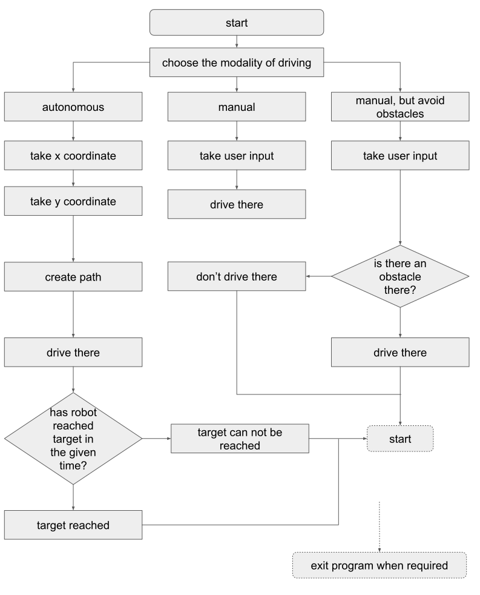

# RT_ROS-slam_teleop

Logic behind the solutino (flow chart)
--------------------------------------
NOTICE: In the flowchart - "yes" is always rightmost arrow, while "no" is always leftmost arrow with respect to the decision blocks

--------------------------------------
TO RUN THE CODE:
Copy the required files:
>git clone the "final_assignment" repository to your catkin workspace src

Run simulator:
>>roslaunch final_assignment simulation_gmapping.launch 

>>roslaunch final_assignment simulation_gmapping.launch 

Run the script:
>>roslaunch final_assignment launcher.launch

